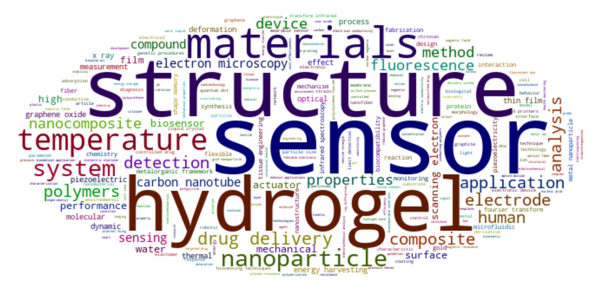
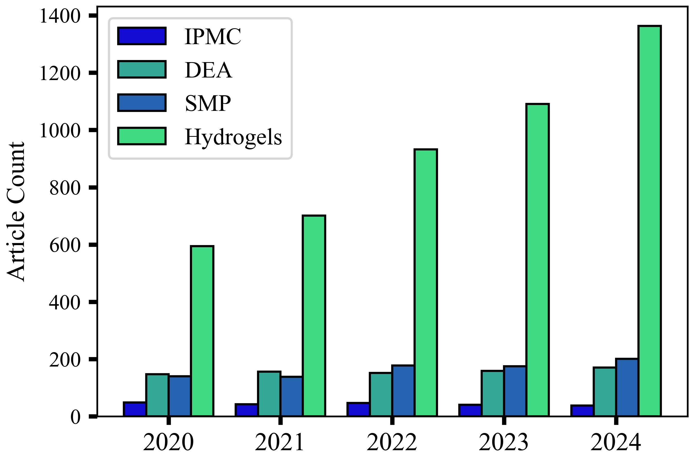
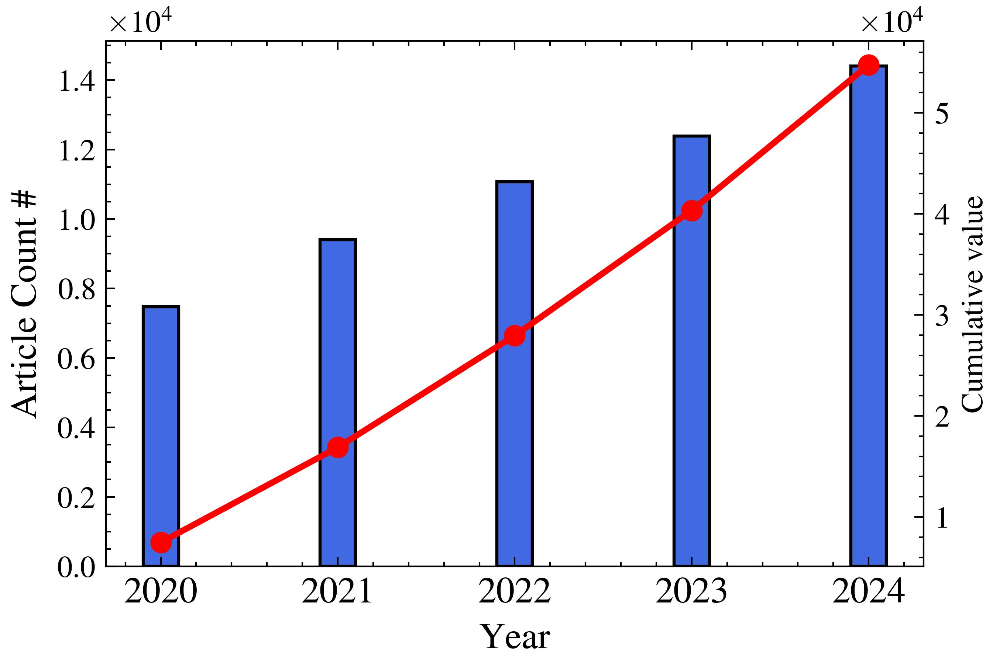
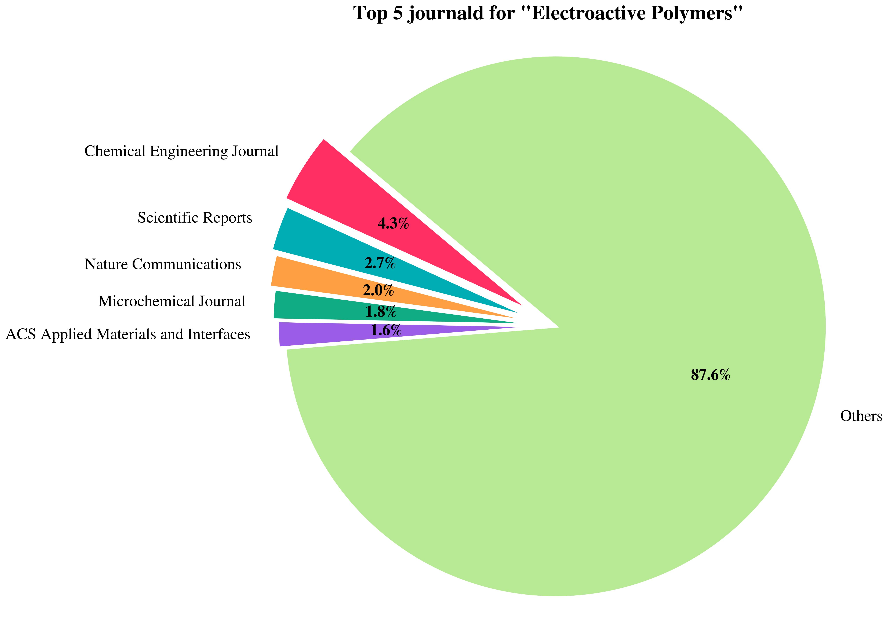

# Literature Analysis

A Jupyter notebook for exploratory bibliometric analysis of academic papers from a CSV dataset.

## Requirements
```bash
pip install pandas matplotlib seaborn numpy networkx scikit-learn wordcloud
```
## Input

Place a `papers.csv` file in the same directory. The notebook expects these columns:

| Column      | Description                        |
|-------------|------------------------------------|
| `year`      | Publication year                   |
| `venue`     | Journal or conference name         |
| `authors`   | Author list (string or list format)|
| `keywords`  | Keywords (string or list format)   |
| `abstract`  | Abstract text *(optional)*         |
| `citations` | Citation count *(optional)*        |

> Column names containing `"cit"` or `"abstract"` are auto-detected.

## How It Works

The notebook runs through these stages in order:

### 1. Data Loading & Inspection
Loads `papers.csv` into a DataFrame and prints shape, columns, and missing value counts.

### 2. Publication Trends
Plots the number of papers published per year as a bar chart → saved as `publications_per_year.png`.

### 3. Venue Analysis
Shows the top 15 most frequent publication venues → saved as `top_venues.png`.

### 4. Author Analysis
Parses the `authors` field (supports both Python list strings and comma-separated values), counts contributions, and plots the top 15 most prolific authors → saved as `top_authors.png`.

### 5. Keyword Analysis
Parses keywords (supports list strings, comma/semicolon/pipe-separated values), counts frequency, and:
- Plots top 20 keywords → `top_keywords.png`
- Generates a keyword word cloud → `keyword_wordcloud.png`
- Plots frequency trends of top 10 keywords over time → `keyword_trends.png`

### 6. Citation Analysis *(if citation column exists)*
- Lists top 10 most-cited papers
- Plots citation count distribution → `citation_distribution.png`
- Plots average citations per year → `avg_citations_per_year.png`

### 7. Co-authorship Network
Builds a graph where nodes are authors and edges represent co-authorship. Visualizes the subgraph of the top 30 authors, with node size proportional to degree → saved as `coauthor_network.png`.

### 8. Abstract Word Cloud *(if abstract column exists)*
Generates a word cloud from all abstracts → saved as `abstract_wordcloud.png`.

### 9. Topic Modeling *(if abstract column exists)*
Uses TF-IDF vectorization + LDA to extract 5 latent topics from abstracts, printing the top 10 words per topic.

### 10. Summary Statistics
Prints a final summary: total papers, year range, unique venues, authors, keywords, and citation stats.

## Output Files

| File(s)                     | Description                                  |
|-----------------------------|----------------------------------------------|
| `DDS_WordCloud.jpg`         | Word Cloud                                   |
| `Keyword_Literature.jpg`    | Papers published per year                    |
| `SPA_in_Literature.jpg`     | Top 15 venues                                |
| `pie_chart.jpg`             | Most frequent journals for a given keyword   |


## Usage

bash
jupyter notebook Literature-Analysis.ipynb

Run all cells top to bottom (`Kernel > Restart & Run All`).


<table>
  <tr>
    <td width="100%">
      
    </td>
  </tr>
</table>

<table>
  <tr>
    <td width="50%">
      
    </td>
    <td width="50%">
      
    </td>
  </tr>
</table>

<table>
  <tr>
    <td width="33%">
      
    </td>
  </tr>
</table>